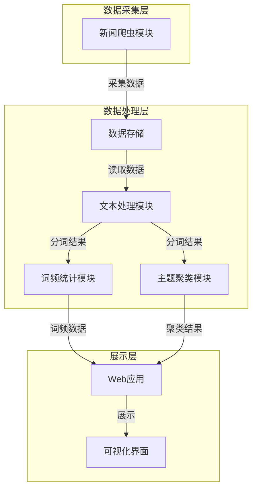
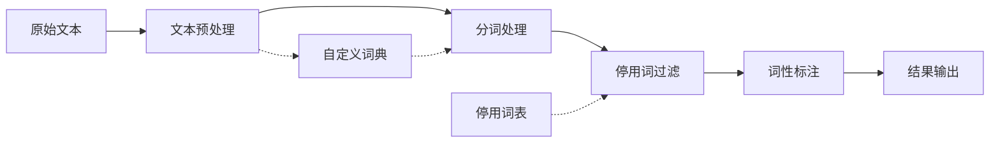
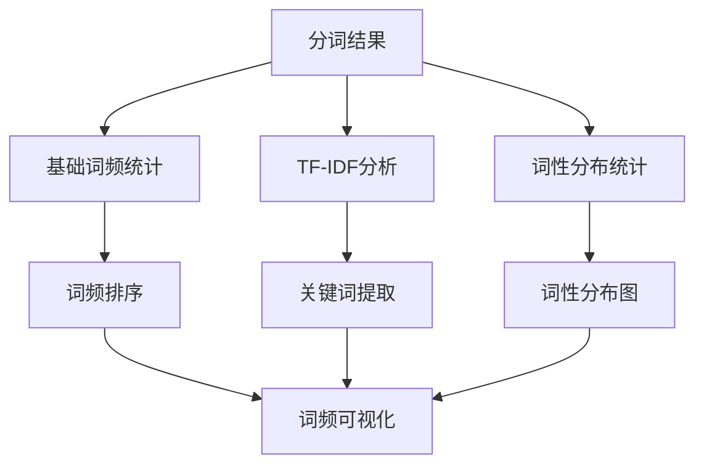
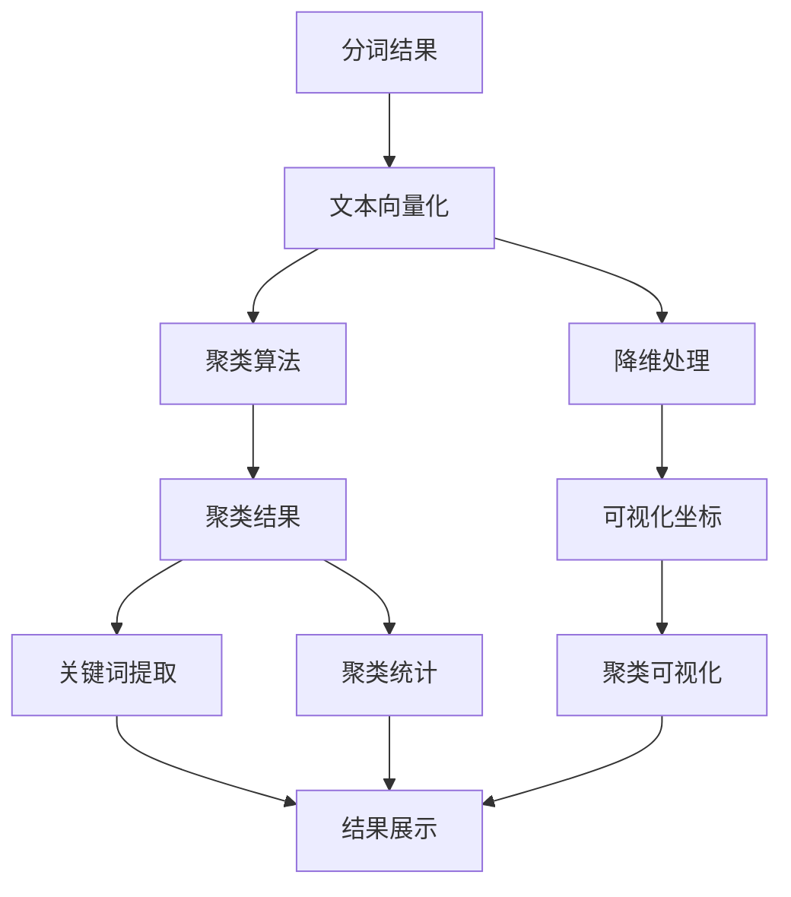
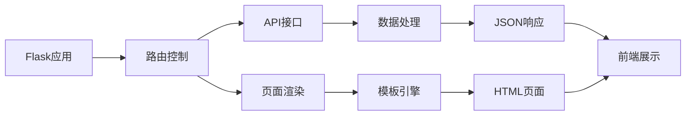
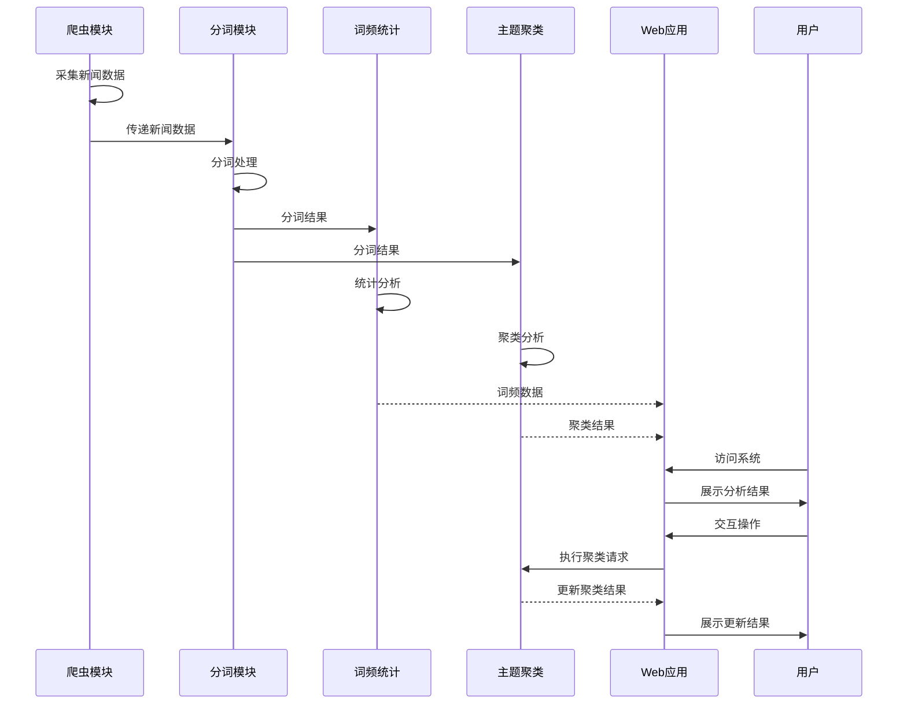

# 新闻分析系统

## 项目概述

这是一个集成了爬虫、文本分析和可视化功能的新闻分析系统。系统通过爬虫从指定网站实时获取热点新闻数据，对新闻文本进行分词处理、词频统计和主题聚类分析，并通过Web界面直观展示分析结果，帮助用户快速把握新闻热点和主题趋势。

## 系统架构



## 功能模块

### 1. 新闻爬虫模块

爬虫模块负责从指定网站实时获取热点新闻数据，支持多种运行模式和灵活配置。

#### 主要特点

- **数据问题修复**：
  - 规范化序号，确保连续且不重复
  - 智能识别新闻来源，不再显示"未知来源"
  - 自动去重功能，避免重复采集同一新闻
  - 提取更多元数据（发布时间、摘要等）

- **运行模式**：
  - 单次采集模式：采集一次数据，保存为带时间戳的CSV和Excel文件
  - 持续采集模式：按指定时间间隔（默认5分钟）持续采集，增量更新同一个文件

- **其他功能**：
  - 完整的命令行参数支持，灵活配置运行参数
  - 详细的日志记录系统，记录运行状态和错误信息
  - 自动截图和HTML缓存，便于调试和问题分析
  - 执行摘要生成，记录每次采集的统计信息

### 2. 文本处理模块

文本处理模块负责对新闻标题和内容进行分词处理，为后续分析提供基础。



#### 分词处理流程

- **预处理阶段**
  - 清洗文本（去除HTML标签、特殊符号等）
  - 标准化处理（全角转半角、简繁转换等）
  - 格式统一（大小写、空格处理等）

- **分词策略**
  - 基于jieba分词库实现中文分词
  - 采用精确模式为主，搜索引擎模式为辅
  - 针对新闻标题特点进行优化（短文本优化）

- **自定义词典**
  - 建立领域特定词典（热门人物、机构、产品名称）
  - 实现动态更新机制（定期从热词中提取新词）
  - 支持用户手动添加专业术语

- **分词优化**
  - 停用词处理（多来源综合停用词表）
  - 新词发现（基于统计模型自动发现新词）
  - 分词纠错（常见错误模式识别与纠正）

### 3. 词频统计模块

词频统计模块对分词结果进行统计分析，识别热门词汇和关键词。



#### 统计分析功能

- **基础词频统计**
  - 全局词频计算与排序
  - 按时间窗口的词频变化趋势
  - 按来源平台的词频差异对比

- **权重优化**
  - 实现TF-IDF算法识别关键词
  - 标题词汇加权处理
  - 考虑词性在权重计算中的影响

- **可视化展示**
  - 词频排行榜
  - 词频百分比和累计百分比
  - 按词性筛选统计结果

### 4. 主题聚类模块

主题聚类模块使用机器学习算法对新闻进行聚类，发现新闻主题结构。



#### 聚类分析功能

- **文本向量化**
  - TF-IDF向量化
  - 特征选择与降维
  - 向量空间模型构建

- **聚类算法**
  - K-means聚类
  - 层次聚类
  - 密度聚类（DBSCAN）

- **结果分析**
  - 聚类主题关键词提取
  - 聚类规模统计
  - 聚类可视化（2D/3D）

### 5. Web应用模块

Web应用模块提供用户友好的界面，展示分析结果并支持交互操作。



#### Web功能特点

- **数据展示**
  - 分词结果展示
  - 词频统计表格与图表
  - 主题聚类可视化

- **交互功能**
  - 词频搜索与筛选
  - 聚类参数调整
  - 数据导出功能

- **实时处理**
  - 支持实时运行聚类
  - 动态更新分析结果
  - 响应式界面设计

## 目录结构

```
news_crawler/
│
├── data/                   # 保存爬取的数据
│   ├── news_*_*.csv        # 单次模式数据文件（CSV格式）
│   ├── news_*_*.xlsx       # 单次模式数据文件（Excel格式）
│   └── continuous_news_*.csv # 持续模式数据文件
│
├── word_segmentation/      # 分词处理结果
│   ├── segmented_news_*.csv # 分词后的数据
│   ├── word_frequency_*.csv # 词频统计结果
│   └── visualization/      # 可视化结果
│       ├── clusters_2d.png # 聚类可视化图像
│       └── cluster_data.json # 聚类结果数据
│
├── templates/              # Web应用模板
│   ├── index.html          # 首页模板
│   ├── segmentation.html   # 分词结果页面
│   ├── word_frequency.html # 词频统计页面
│   └── topic_clustering.html # 主题聚类页面
│
├── static/                 # 静态资源
│   ├── css/                # 样式文件
│   ├── js/                 # JavaScript文件
│   └── images/             # 图片资源
│
├── logs/                   # 日志文件目录
│   ├── crawler_*.log       # 爬虫运行日志
│   ├── segmentation_*.log  # 分词处理日志
│   └── web_app_*.log       # Web应用日志
│
├── news_crawler.py         # 爬虫主程序
├── word_segmentation.py    # 分词处理模块
├── topic_clustering.py     # 主题聚类模块
├── web_app.py              # Web应用程序
├── requirements.txt        # 项目依赖
└── README.md               # 项目说明
```

## 安装步骤

1. 克隆或下载本项目代码
2. 安装依赖
   ```bash
   pip install -r requirements.txt
   ```
3. 安装Playwright浏览器引擎（用于爬虫模块）
   ```bash
   playwright install
   ```

## 运行方法

### 1. 爬虫模块

#### 使用启动脚本（推荐）

双击运行`start_crawler.bat`，根据提示选择运行模式：

```
1. 单次采集模式 - 采集一次数据并保存
2. 持续采集模式 - 每5分钟自动采集一次数据
3. 自定义间隔采集 - 指定时间间隔的持续采集模式
4. 退出
```

#### 使用命令行直接运行

```bash
# 单次采集模式
python news_crawler.py --mode=single

# 持续采集模式（默认5分钟间隔）
python news_crawler.py --mode=continuous

# 自定义间隔的持续采集模式
python news_crawler.py --mode=continuous --interval=10
```

### 2. 分词处理

```bash
# 处理新闻数据，生成分词结果
python word_segmentation.py --input=data/news_2025-02-25.csv --output=word_segmentation/segmented_news_2025-02-25.csv

# 生成词频统计
python word_segmentation.py --mode=frequency --input=word_segmentation/segmented_news_2025-02-25.csv --output=word_segmentation/word_frequency_2025-02-25.csv
```

### 3. 主题聚类

```bash
# 执行主题聚类
python topic_clustering.py --input=word_segmentation/segmented_news_2025-02-25.csv --output=word_segmentation/visualization --clusters=10
```

### 4. Web应用

```bash
# 启动Web应用
cd news_crawler
python web_app.py
```

然后在浏览器中访问 http://localhost:5000 即可查看分析结果。

## 数据字段说明

### 新闻数据字段

| 字段名           | 说明                                    |
|-----------------|----------------------------------------|
| number          | 按顺序编号的序号（从1开始连续）          |
| original_number | 原始网页中的序号（如果有）              |
| title           | 新闻标题                                |
| source          | 新闻来源（网站名称）                    |
| link            | 新闻链接                                |
| summary         | 新闻摘要（如果能够提取）                |
| pub_time        | 发布时间（如果能够提取）                |
| collect_time    | 采集时间                                |
| news_id         | 新闻唯一标识（用于去重）                |

### 词频统计字段

| 字段名           | 说明                                    |
|-----------------|----------------------------------------|
| word            | 词汇                                    |
| frequency       | 出现频率                                |
| percentage      | 占总词数百分比                          |
| percentage_str  | 格式化的百分比字符串                    |
| pos             | 词性标注                                |
| cumulative      | 累计百分比                              |

## 系统工作流程



## 注意事项

- 请确保网络连接稳定，特别是在使用爬虫模块时
- 避免过于频繁的访问以防被目标网站限制
- 定期检查日志和截图，确保系统正常运行
- 持续模式下建议设置合理的采集间隔（建议不低于3分钟）
- Web应用默认在开发模式下运行，生产环境请使用WSGI服务器

## 常见问题解决

1. **无法启动浏览器**：确保已正确安装Playwright及其浏览器引擎
   ```bash
   playwright install
   ```

2. **找不到新闻数据**：网页结构可能已更改，检查最新的截图和HTML缓存

3. **CSV文件编码问题**：程序使用UTF-8-SIG编码，如遇到乱码请检查打开方式

4. **Web应用无法启动**：确保在正确的目录下运行，并检查端口是否被占用
   ```bash
   cd news_crawler
   python web_app.py
   ```

5. **聚类结果不理想**：尝试调整聚类参数，如聚类数量、特征数量等
   ```bash
   python topic_clustering.py --clusters=15 --features=1500
   ```

## 后续优化目标

### 数据库集成
* 使用MongoDB存储数据
* 使用MongoDB的聚合功能对数据进行分析和处理
* 使用MongoDB的索引优化查询性能
* 使用MongoDB的备份和恢复机制保证数据的安全性

### 高级分析功能
* 对新闻内容进行情感分析
* 实现事件检测和追踪
* 添加实体识别和关系提取
* 开发新闻摘要自动生成

### 系统性能优化
* 实现增量分析功能
* 优化聚类算法性能
* 添加数据缓存机制
* 实现分布式处理框架


